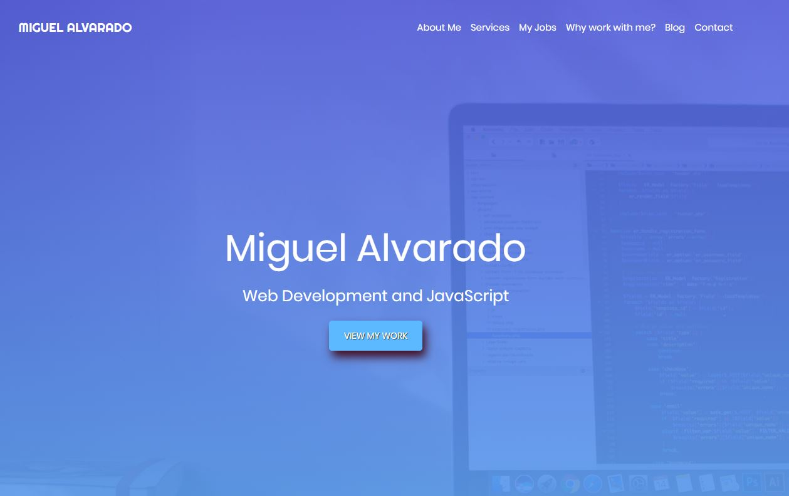
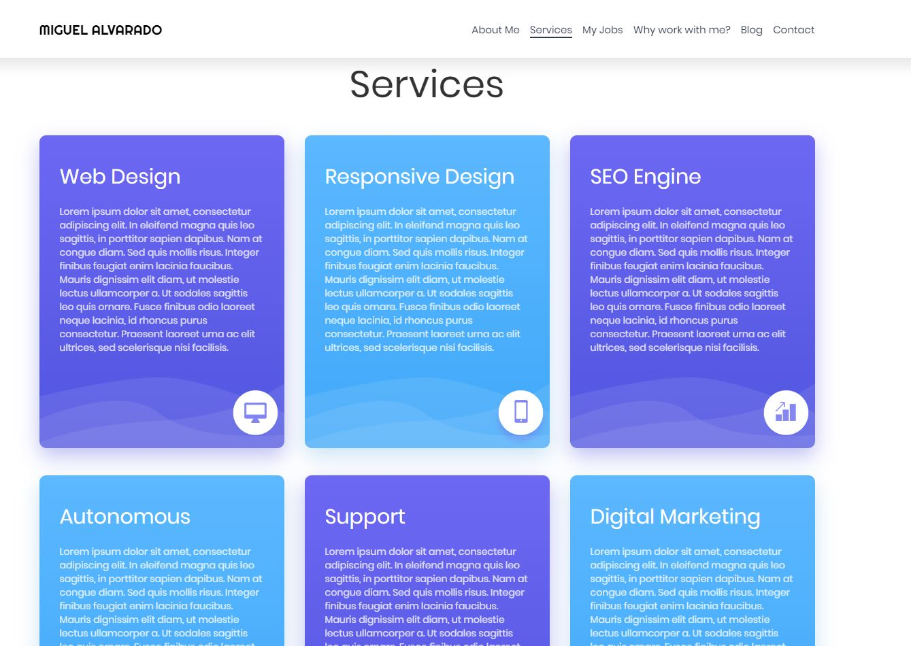
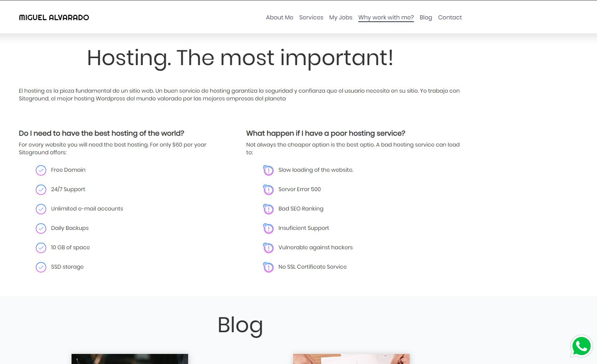
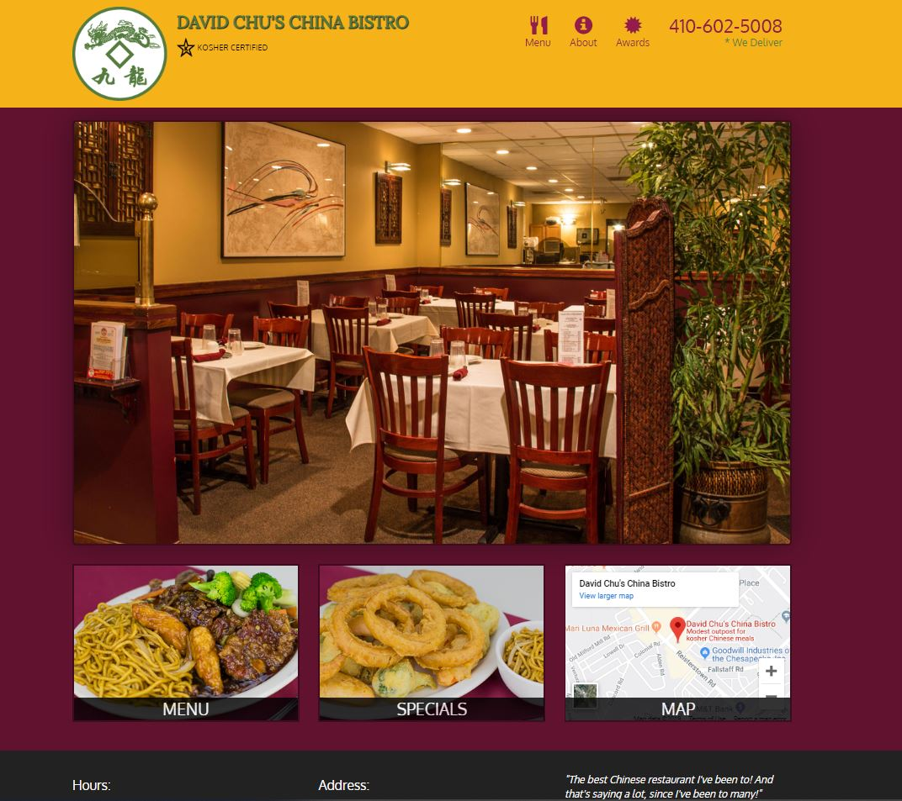
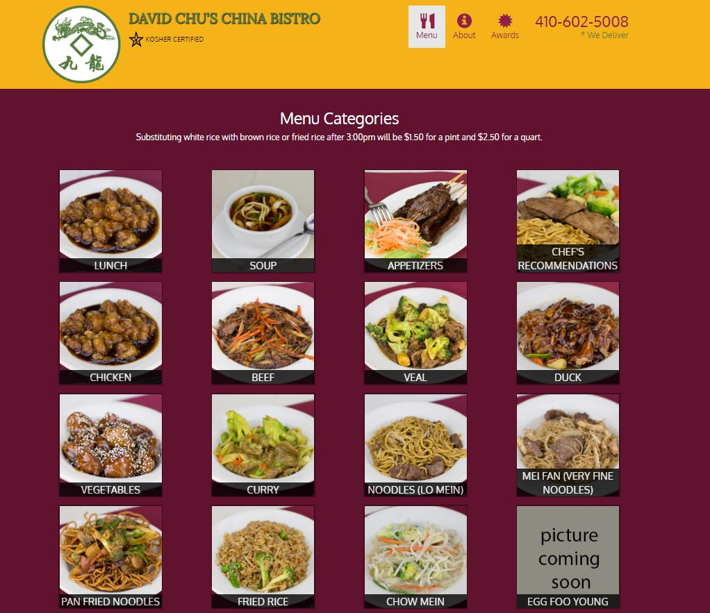
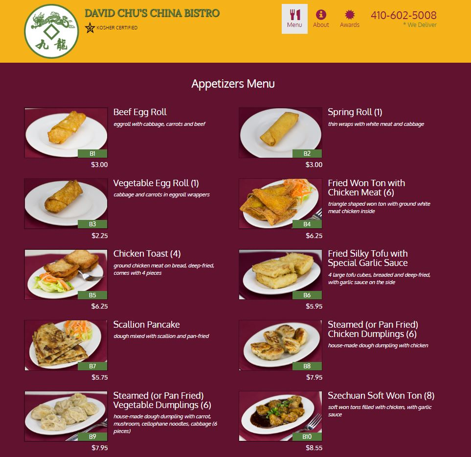
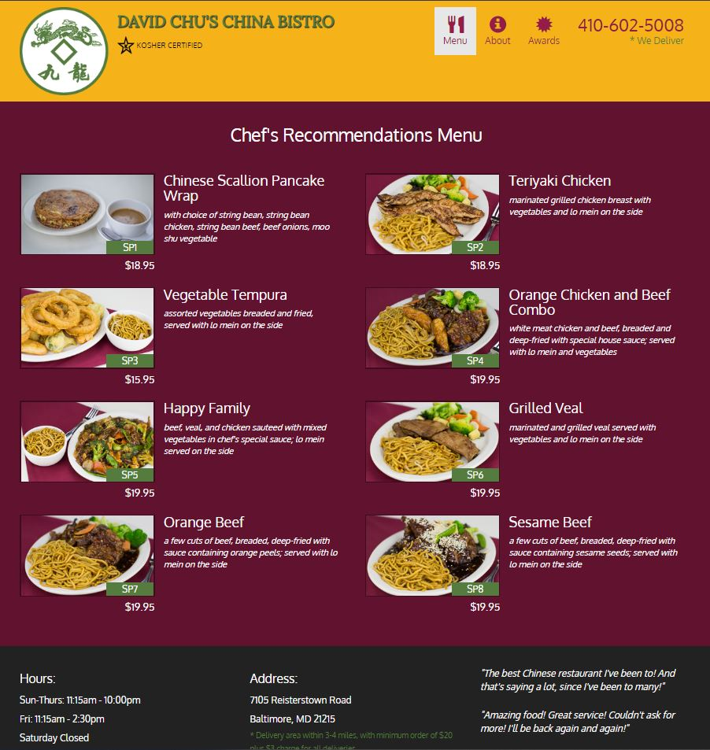

# FrontEnd website and SPA project (JSON, AJAX)
The following repositorie host two sites, the restaurant site and the presentation website. Inside Course-Lessons folder you can find all the lessons for the Coursera Webvelopment course. The restaurant site was the final project for such course. The Presentation website was developed by myself to use it as a future portfolio template.
 
 
The following website was created using HTML, CSS and JavaScript. For CSS Boostrap 4.0 was implemented. Sublime and VS Code were used along with browser-sync for the development.
 
Link: https://alvarmig.github.io/Coursera-webdev/my_site/

The purpose of the website was to developm my frontend skills with boostrap 4.0, the page is responsive and will display properly with mobile, tablets and desktop resoltuions. 

In the picture above the navigation menu can be seen along with the intial section.
 
 

Grid layout was used to display the severl columns for the services section.
 
 

The navigation bar will indicate the user in which section they are.

As this is a static website no much information is provided about the development.

 
 
 
 

###########################################################################################
The following website SPA was implemented using HTML, BOOSTRAP 3, Javascript, AJAX, JSON. 
 
Link: https://alvarmig.github.io/Coursera-webdev/site/

JSON is served via herokuapp https://davids-restaurant.herokuapp.com/categories.json 

It´s A SPA (Single Page Application) with responsive implementation (Boostrap 3.0).

AjaxUtils was used to simplify the requests (all of them GET).

DOM manipulations was also used to implement some features

Front page of Restaurant application.
 
 

Menu categories page of Restaurant application.
 
 

From the menu categories page, the user can go to a specific section that contains each one of the categories of the dishes.
 
 

Special section, all the infromation is served via a JSON file that contains the data for the description, title and price of the dish.
 
 
